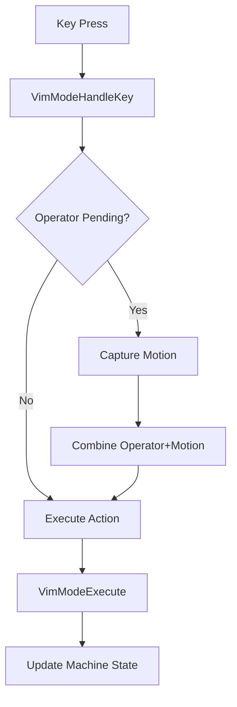
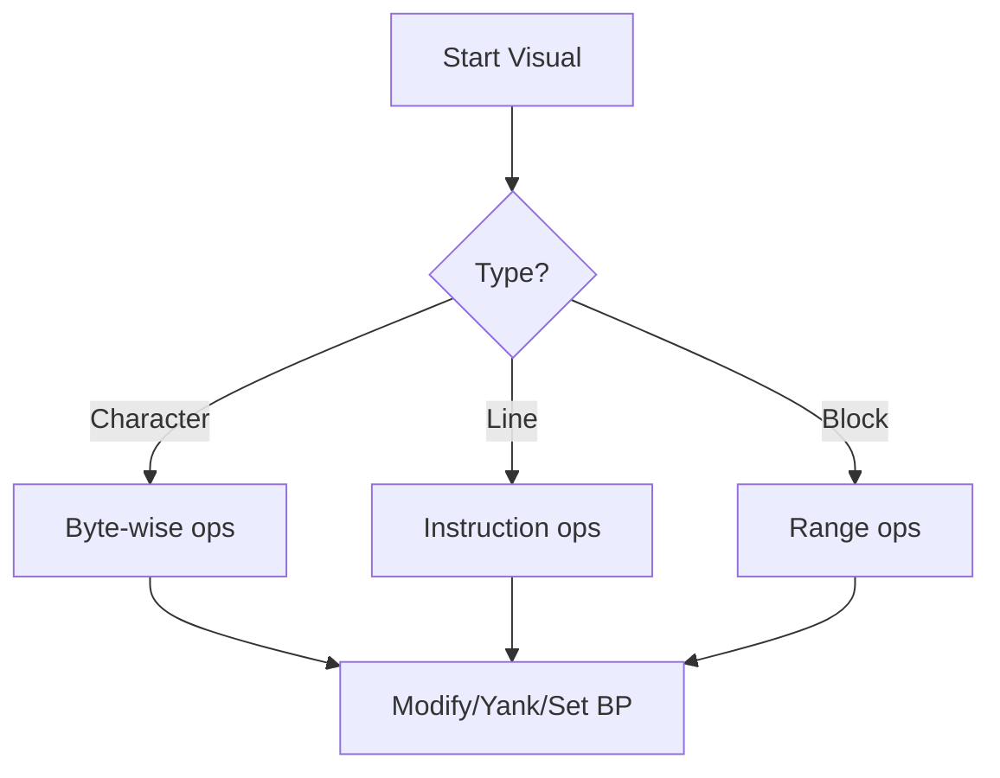
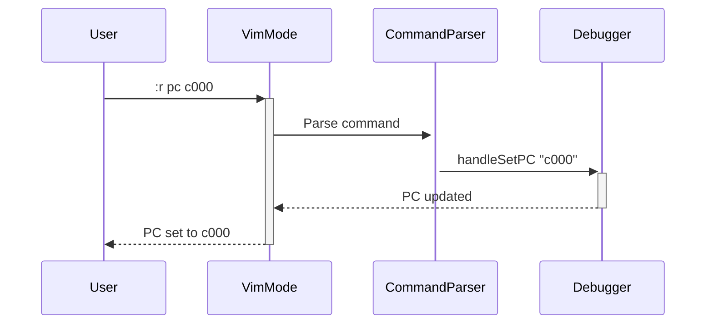

# VimMode Debugger Enhancement Proposal

## 1. Current Architecture Analysis

### Command Processing Flow


### State Management
```mermaid
stateDiagram-v2
    [*] --> NormalMode
    NormalMode --> VisualMode: v, V, Ctrl-v
    NormalMode --> CommandMode: :
    VisualMode --> NormalMode: Esc
    CommandMode --> NormalMode: Enter
    VisualMode --> CommandMode: :
```

## 2. Proposed Improvements

### Enhanced Composability


Example Commands:
1. `d2w` = Delete 2 words
2. `c$` = Change to line end
3. `"ay3j` = Yank 3 lines to register a

### Visual Mode Operations


### VICE Command Mapping
| VICE Command | Vim Equivalent | Internal Handler |
|--------------|----------------|------------------|
| `:m 0400` | `:m 0400` | `handleDisassemble` |
| `:r a 00` | `:set a 00` | `handleSetReg8` |
| `:g` | `:continue` | Returns `ExecuteStep` |

## 3. Implementation Plan

### Phase 1: Core Enhancements
1. Expand `Motion` type in [`VimModeCore.hs`](src/MOS6502Emulator/Debugger/VimModeCore.hs):
```haskell
data Motion = ...
            | WordObject Int
            | LineObject Int
            | BracketObject
```

2. Implement visual selection in `VimState`:
```haskell
data VimState = ...
  { vsVisualType :: VisualType  -- Char/Line/Block
  , vsSelectionStart :: Word16
  , vsSelectionEnd :: Word16 }
```

### Phase 2: VICE Integration


## 4. Expected Outcomes
- **Vim-like composability** for debug operations
- **Visual mode** with range operations
- **VICE-compatible** command mode
- **Register manipulation** via `"aY`/`"ap` syntax

Would you like to proceed with implementation in code mode?