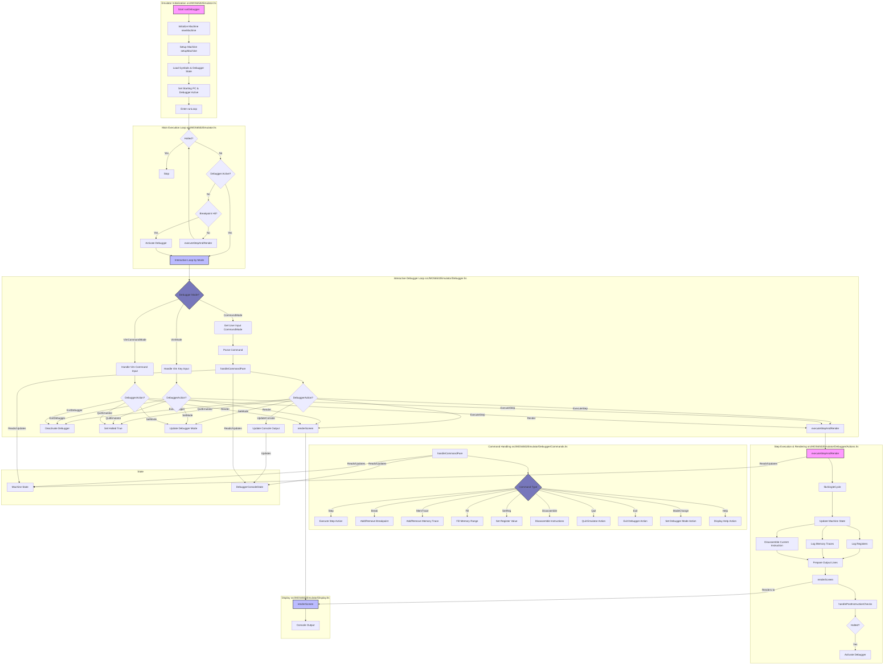

# Debugger Flowchart
This flowchart illustrates the main components and flow of the MOS6502 Emulator's debugger, including




# Debugger Data Flow (Vim Mode)
This diagram details the data flow and control logic for the debugger's Vim mode, focusing on how user input is processed, how state is managed, and how the screen is rendered.

```mermaid
graph TD
    subgraph User Input & Main Loop ["src/MOS6502Emulator/Debugger/VimMode/Enhanced.hs"]
        Start[interactiveLoopHelper] --> SetupTerminal["hSetBuffering, hSetEcho"]
        SetupTerminal --> Loop(interactiveLoopHelperInternal)
        Loop -- Checks --> IsHalted{Machine Halted?}
        IsHalted -->|Yes| QuitAction[Return QuitEmulatorAction]
        IsHalted -->|No| GetKey[liftIO getKey]
        GetKey -- key --> HandleKey
        HandleKey -- "(action, output, newState)" --> UpdateState[Update Machine State (vimState, mConsoleState, debuggerMode)]
        UpdateState --> Render[Render Screen]
        Render --> HandleAction{DebuggerAction?}
        HandleAction -->|ExecuteStepAction| StepAction[Return ExecuteStepAction to outer loop]
        HandleAction -->|ExitDebuggerAction| ExitAction[Return ExitDebuggerAction]
        HandleAction -->|QuitEmulatorAction| QuitAction
        HandleAction -->|NoDebuggerAction, ...| Loop
        Loop --> RestoreTerminal["finally: Restore Terminal"]
    end

    subgraph Key Handling Dispatch ["src/MOS6502Emulator/Debugger/VimMode/Enhanced.hs"]
        HandleKey[handleVimKey] -- based on vimState --> KeyDispatch{Mode?}
        KeyDispatch -->|VimCommandMode| HVC_Key[handleVimCommandModeKey]
        KeyDispatch -->|VimMode| HVN_Key[handleVimNormalModeKey]
    end

    subgraph Vim Normal Mode ["src/MOS6502Emulator/Debugger/VimMode/HandleKey.hs"]
        HVN_Key[handleVimNormalModeKey] --> IsVisual{In Visual Mode?}
        IsVisual -->|Yes| HVV_Key[handleVisualKey]
        IsVisual -->|No| IsOperatorPending{Operator Pending?}
        IsOperatorPending -->|Yes| HandleOpMotion[Handle Motion for Operator (d,c,y)]
        HandleOpMotion --> EA_Execute[executeAction]
        IsOperatorPending -->|No| HandleNormalCmd[Handle Normal Command]
        HandleNormalCmd -- "e.g., j,k,w,b" --> EM_Execute[executeMotion]
        HandleNormalCmd -- "e.g., r,+,B" --> EA_Execute[executeAction]
        HandleNormalCmd -- "e.g., d,c,y" --> SetOperator[Set vsOperator]
        HandleNormalCmd -- ":" --> SetModeVimCmd[Set Mode to VimCommandMode]
        SetOperator --> HVN_Key
    end

    subgraph Vim Command Mode ["src/MOS6502Emulator/Debugger/VimMode/Enhanced.hs"]
        HVC_Key[handleVimCommandModeKey] --> KeyType{Key?}
        KeyType -->|'\n' (Enter)| ExecVimCmd[Execute Command]
        ExecVimCmd --> PDC[parseDebuggerCommand]
        PDC --> HCP[handleCommandPure]
        HCP -- "(newMachine, output, action)" --> HVC_Key
        KeyType -->|'\DEL' (Backspace)| UpdateBuffer[Update Command Buffer]
        KeyType -->|'char'| UpdateBuffer
        UpdateBuffer --> HVC_Key
    end

    subgraph Action & Motion Execution ["src/MOS6502Emulator/Debugger/VimMode/Execute.hs"]
        EM_Execute[executeMotion] -- Reads --> S_Machine[Machine State]
        EM_Execute -- "Returns new cursor pos" --> HVN_Key
        EA_Execute[executeAction] -- Reads/Writes --> S_Machine
        EA_Execute -- Can call --> EVC_Execute[executeVimCommand]
        EVC_Execute --> HCP
        EA_Execute -- "Returns (action, pos, output)" --> HVN_Key
    end
    
    subgraph Command Handling ["src/MOS6502Emulator/Debugger/Commands.hs"]
        HCP[handleCommandPure] -- Reads/Updates --> S_Machine
        HCP -- Returns --> Result["(Machine, [String], DebuggerAction)"]
    end

    subgraph Rendering ["src/MOS6502Emulator/Debugger/VimMode/Enhanced.hs"]
        Render --> RVS[renderVimScreen]
        RVS --> ViewMode{vsViewMode?}
        ViewMode -->|CodeView| GetDisassembly[Get Disassembly]
        ViewMode -->|MemoryView| GetMemory[Fetch Memory Bytes]
        ViewMode -->|RegisterView| GetRegisters[logRegisters]
        ViewMode -->|StackView| GetStack[Fetch Stack Bytes]
        GetDisassembly --> CallRenderScreen
        GetMemory --> CallRenderScreen
        GetRegisters --> CallRenderScreen
        GetStack --> CallRenderScreen
        CallRenderScreen[renderScreen] --> RenderStatus[Render Status & Command Line]
        RenderStatus --> ConsoleOutput[Output to Console]
    end

    subgraph State
        S_Machine["Machine State\\n(Registers, Memory, Breakpoints, vimState, mConsoleState, etc.)"]
    end

    HandleKey -- Reads --> S_Machine
    HCP -- Reads/Writes --> S_Machine
    EM_Execute -- Reads --> S_Machine
    EA_Execute -- Reads/Writes --> S_Machine
    RVS -- Reads --> S_Machine

    style Start fill:#f9f, stroke:#333, stroke-width:2px
    style Loop fill:#bbf, stroke:#333, stroke-width:2px
    style HandleKey fill:#77b, stroke:#333, stroke-width:2px
    style RVS fill:#f9f, stroke:#333, stroke-width:2px
    style ConsoleOutput fill:#bbf, stroke:#333, stroke-width:2px
```